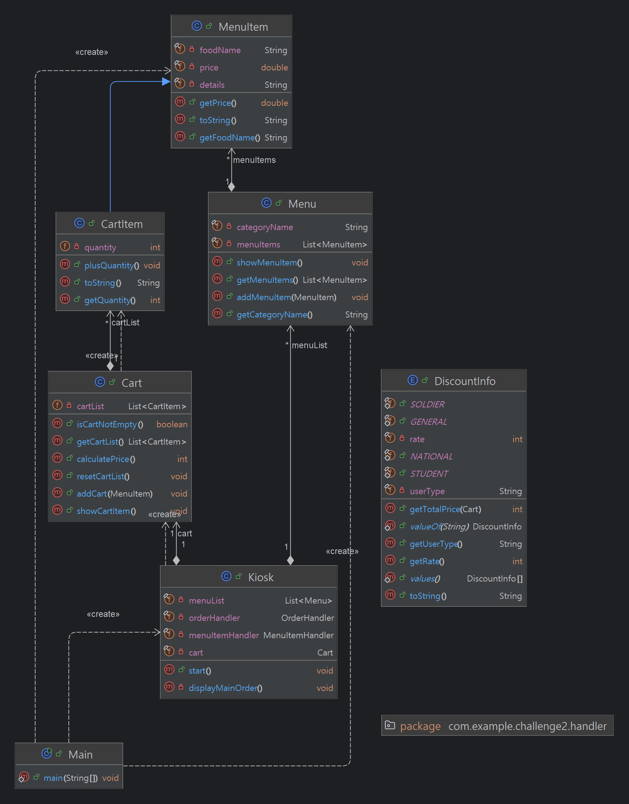

# ⭐️[컬렉션, enum, 람다, 스트림등을 이용한 계산기 프로젝트]⭐️


## 💞 여러 상황에 맞춰 구현했습니다.
✅ 같은 물건을 장바구니에 두번 넣었을 경우 ➔ 수량이 증가하도록</br>
✅ 주문이 완료되거나 진행 중인 주문을 취소하는 경우 ➔ 장바구니 리스트가 삭제되도록</br>
✅ 장바구니 추가를 취소하는 경우 ➔ 다시 메뉴 선택 목록으로 돌아가도록</br>
✅ 뒤로가기 버튼을 누르는 경우 ➔ 다시 메뉴 선택 목록으로 돌아가도록</br>
✅ 메뉴 숫자 이외의 다른 숫자를 입력하는 경우 ➔ 다시 메뉴 선택 입력창이 나오도록</br>
✅ int 타입 이외의 다른 타입을 입력하는 경우 ➔ 다시 메뉴 선택 입력창이 나오도록</br>

## 💛 LV1(lv1 패키지)
Scanner를 통해 입력을 받고 조건문, 반복문을 통해 입력 데이터를 처리합니다.

## 💛 LV2(lv2 패키지)
키오스크의 햄버거 메뉴를 클래스와 List를 통해 관리합니다.</br>
**MenuItem 클래스**에서는 버거 이름, 가격, 설명 필드와 생성자, 일정한 출력을 위한 toString메소드가 오버라이딩 되어있습니다.</br>
**Main 클래스**에서는 MenuItem 객체 생성을 통해 이름, 가격, 설명을 세팅하고 리스트를 통해 이를 관리합니다.</br>

## 💛 LV3(lv3 패키지)
메인함수에서 다루던 전체 순서 제어(사용자 입력, 출력 등)를 Kiosk 클래스를 통해 관리합니다.</br>
**Kiosk 클래스**에서는 MenuItem을 관리하는 리스트가 필드로 할당되어있고 사용자 입력, 출력 등을 담당합니다.</br>

## 💛 LV4(lv4 패키지)
Menu클래스를 만들어서 카테고리별로 주문이 가능하도록 객체 지향 설계를 적용했습니다.</br>
**Menu 클래스**에서는 LV3에서 Kiosk 클래스에서 다루던 MenuItem 리스트를 관리하고 카테고리 별로 나누어 데이터가 저장되도록 합니다. 메뉴 카테고리 이름을 반환하는 메소드가 구현되어 있습니다.</br>

## 💛 LV5(lv5 패키지)
캡슐화를 적용하여 MenuItem, Menu, Kiosk 클래스의 필드에 직접 접근하지 못하도록 설정되었습니다.</br>
getter, setter를 통해 데이터를 관리합니다.</br>

## 💛 도전 LV1(challenge1 패키지)
사용자가 선택한 메뉴를 장바구니에 추가하는 기능을 제공합니다. 메뉴명, 수량, 가격 정보를 저장하며 동적으로 추가 및 조회가 가능합니다.</br>
**CartItem 클래스**에서 MenuItem 클래스를 상속받아 메뉴명, 가격 정보 필드와 관련 메소드들을 사용할 수 있도록 구현하였고, 장바구니 아이템 목록 출력을 위해 toString()메소드가 오버라이딩 되어있습니다.</br>
**Cart 클래스**에서는 CartItem을 관리하기 위한 리스트가 필드로 할당되어 있으며 카트에 아이템을 추가하는 함수, 장바구니 목록을 가져오는 함수, 장바구니 리셋하는 함수, 장바구니가 비었는지 확인하는 함수, 총 금액을 계산하는 함수 등이 구현되어 있습니다.</br>
**Kiosk 클래스**에서 장바구니 추가 및 취소, 장바구니에 물건이 있는 경우 메뉴를 다르게 출력하도록 구현하였고 장바구니 메뉴 주문시 총 금액 출력과 장바구니 리셋을 하도록 작성하였습니다.</br>
또 handler 패키지의 **MenuItemHandler, OrderHandler 클래스**를 통해 Kiosk 클래스에서의 중복되는 메소드를 정리하고 클래스 간 역할 분리를 해주었습니다.</br>

## 💛 도전 LV2(challenge2 패키지)
Enum을 활용해 사용자 유형별 할인율을 관리하고 stream과 람다를 사용해서 보다 간결한 메소드 구현이 이루어졌습니다.</br>
**DiscountInfo클래스**에서 사용자 유형별로 Enum을 정의하고 할인율을 적용한 총 금액을 계산하는 메소드까지 구현되어 있습니다.</br>
**Menu 클래스**에서 할인 전의 금액을 계산하는 함수, 메뉴 리스트 안에 있는 아이템을 하나씩 출력해주는 함수를 각각 stream.mapToDouble, IntStream.range를 활용해 보다 간결하게 수정하였습니다.</br>
또한 **Cart 클래스**에서 햄버거 종류 두 개를 할인 품목으로 넣고 할인되는 버거는 두 종류를 다 담을 수 없다는 설정을 두고 stream.filter()를 활용해 특정 메뉴를 장바구니에서 제거하는 코드를 추가하였습니다.</br>

<details>
<summary>도전 LV2 실행화면 예시(두 종류의 할인 품목을 장바구니에 넣으면 기존 품목을 삭제하는 기능)</summary>

```
[ MAIN MENU ]
1. Burgers
2. Drinks
3. Desserts
0. 종료 | 종료
메뉴의 숫자를 입력해주세요: 1

[ BURGERS MENU ]
1. 빅맥    | w 0.6 | 쇠고기 패티 두장, 소스, 치즈, 야채가 어우러진 버거
2. 쿼터파운더치즈 | w 0.7 | 쇠고기 패티, 두꺼운 치즈, 야채, 머스타드가 들어간 버거
3. 슈슈버거  | w 0.4 | [할인]통새우살 가득한 버거
4. 불고기버거 | w 0.3 | [할인]불고기 소스와 쇠고기 패티가 어우러진 버거
0. 뒤로가기 | 뒤로가기
   할인 품목은 한 종류만 주문 가능합니다.
   메뉴의 숫자를 입력해주세요: 3

선택한 메뉴: 슈슈버거  | w 0.4 | [할인]통새우살 가득한 버거

슈슈버거  | w 0.4 | [할인]통새우살 가득한 버거
위 메뉴를 장바구니에 추가하시겠습니까?
1. 확인       2. 취소
   1

슈슈버거이(가) 장바구니에 추가되었습니다.


[ MAIN MENU ]
1. Burgers
2. Drinks
3. Desserts
0. 종료 | 종료

[ ORDER MENU ]
4. Orders      | 장바구니를 확인 후 주문합니다.
5. Cancel      | 진행중인 주문을 취소합니다.
   메뉴의 숫자를 입력해주세요: 1

[ BURGERS MENU ]
1. 빅맥    | w 0.6 | 쇠고기 패티 두장, 소스, 치즈, 야채가 어우러진 버거
2. 쿼터파운더치즈 | w 0.7 | 쇠고기 패티, 두꺼운 치즈, 야채, 머스타드가 들어간 버거
3. 슈슈버거  | w 0.4 | [할인]통새우살 가득한 버거
4. 불고기버거 | w 0.3 | [할인]불고기 소스와 쇠고기 패티가 어우러진 버거
0. 뒤로가기 | 뒤로가기
   할인 품목은 한 종류만 주문 가능합니다.
   메뉴의 숫자를 입력해주세요: 4

선택한 메뉴: 불고기버거 | w 0.3 | [할인]불고기 소스와 쇠고기 패티가 어우러진 버거

불고기버거 | w 0.3 | [할인]불고기 소스와 쇠고기 패티가 어우러진 버거
위 메뉴를 장바구니에 추가하시겠습니까?
1. 확인       2. 취소
   1

불고기버거이(가) 장바구니에 추가되었습니다.


[ MAIN MENU ]
1. Burgers
2. Drinks
3. Desserts
0. 종료 | 종료

[ ORDER MENU ]
4. Orders      | 장바구니를 확인 후 주문합니다.
5. Cancel      | 진행중인 주문을 취소합니다.
   메뉴의 숫자를 입력해주세요: 2

[ DRINKS MENU ]
1. 콜라    | w 0.2 | 시원한 콜라
2. 사이다   | w 0.2 | 시원한 사이다
3. 환타    | w 0.2 | 시원한 환타
0. 뒤로가기 | 뒤로가기
   메뉴의 숫자를 입력해주세요: 1

선택한 메뉴: 콜라    | w 0.2 | 시원한 콜라

콜라    | w 0.2 | 시원한 콜라
위 메뉴를 장바구니에 추가하시겠습니까?
1. 확인       2. 취소
   1

콜라이(가) 장바구니에 추가되었습니다.


[ MAIN MENU ]
1. Burgers
2. Drinks
3. Desserts
0. 종료 | 종료

[ ORDER MENU ]
4. Orders      | 장바구니를 확인 후 주문합니다.
5. Cancel      | 진행중인 주문을 취소합니다.
   메뉴의 숫자를 입력해주세요: 4

아래와 같이 주문하시겠습니까?

[ Orders ]
불고기버거 | w 0.3 | 1개
콜라    | w 0.2 | 1개

[ Total ]
5000원

1. 주문       2. 메뉴판
   1
   할인 정보를 입력해주세요.
1. 국가 유공자 : 10%
2. 군인    : 5%
3. 학생    : 3%
4. 일반    : 0%
   3
   주문이 완료되었습니다. 금액은 w 4850원입니다.


[ MAIN MENU ]
1. Burgers
2. Drinks
3. Desserts
0. 종료 | 종료
   메뉴의 숫자를 입력해주세요: 0
   프로그램을 종료합니다.
```
</details>

---

### 클래스 다이어그램(도전 LV2 기준)
